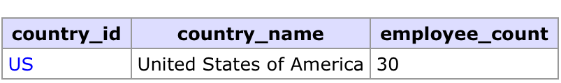

# Examen 2a avaluació BD

## Donada la base de dades definida en [human-resources.sql](./initdb/human-resources.sql), fes les consultes següents.

Diagrama de HumanResourcesDB:

### 1. Mostra el nom, cognom i departament dels empleats que tenen el mateix nom que un altre empleat.

_Escriu la consulta en el fitxer anomenat [1.sql](./1.sql)._

### 2. Mostra el número d'empleats de cada departament.

_Escriu la consulta en el fitxer [2.sql](./2.sql)._

### 3. Mostra l'adreça completa de cada departament.

_Escriu la consulta en el fitxer [3.sql](./3.sql)._

### 4. Mostra el codi i nom dels països amb més empleats que la mitjana d'empleats per païs.

_Escriu la consulta en el fitxer [4.sql](./4.sql)._

### 5. Mostra el nom, cognom i salari de l'empleat millor pagat i de l'empleat pitjor pagat.

_Escriu la consulta en el fitxer [5.sql](./5.sql)._

## 6. Donat el següent diagrama relacional, implementa la base de dades en Postgres.

_Escriu les sentències d'SQL (CREATE TABLE...) per crear la base de dades en el fitxer [6.sql](./6.sql)._

**No és pot generar la base de dades per mitjà d'una GUI o altres eines.**

## Instruccions de lliurament.

Lliura en el Classroom aquest projecte comprimit en un `.zip` que contengi el teu nom i cognoms en el nom del fitxer.

